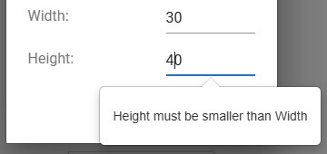

# Validator and Formatter for Anvil

This repository provides a flexible and extensible input validation and formatting module for Anvil applications. Inspired by community discussions, it has been refined over time to support various input components and validation scenarios.

This component was first introduced in this [forum post](https://anvil.works/forum/t/yet-another-validator-and-formatter/10607).



## Features

- **Component Validation**: Attach validation logic to any Anvil component.
- **Custom Error Messages**: Display error messages using labels or Anvil Extras' popovers.
- **Flexible Formatting**: Format input fields (e.g., floats, regex-based formatting).
- **Event-driven**: Trigger validation on specified events (e.g., `lost_focus`, `change`).
- **Custom Validation Functions**: Define custom validation logic with tailored error messages.
- **Support for Various Components**: Works with `TextBox`, `TextArea`, `DatePicker`, and `MultiSelectDropDown`.

## Installation

To use the Validator in your Anvil app:

1. Clone the Validator dependency: [https://anvil.works/build#clone:7Q7NEWYAKDCFZEDR=LYS37EZTLUOMWLNR2CY4I5NM](https://anvil.works/build#clone:7Q7NEWYAKDCFZEDR=LYS37EZTLUOMWLNR2CY4I5NM)
2. Add the cloned app as a dependency to your project.

## Usage

Here's a quick example of how to use the Validator:

```python
from Validator.validator import Validator

def __init__(self, **properties):
  self.init_components(**properties)
  self.validator = Validator()

  # Validate that text_box_1's value is between 5 and 10
  self.validator.between(
    component=self.text_box_1,
    events=['lost_focus', 'change'],
    min_value=5,
    max_value=10,
    include_min=True,
    include_max=False
  )

  # Validate that text_box_8 contains a float and format it
  self.validator.number(
    component=self.text_box_8,
    events=['lost_focus', 'change'],
    format='float 07.3f'
  )

  # Custom validation: text must be greater than 'c'
  self.validator.with_function(
    component=self.text_box_13,
    events=['lost_focus', 'change'],
    validating_function=lambda tb: tb.text >= 'c',
    message='Must be greater than "c"'
  )

def check_all_click(self, **event_args):
  print(self.validator.are_all_valid())
```

## Parameters

The `Validator` class provides several methods to attach validation logic to components. Common parameters across these methods include:

- **component**: The Anvil component to validate.
- **events**: A list of events that trigger validation (e.g., `['lost_focus', 'change']`).
- **error_label**: An optional label component to display error messages. If not provided, errors are shown using popovers.
- **placement**: (optional, default: `'bottom'`) When using popovers for error messages (i.e., when `error_label` is not provided), this specifies the placement of the popover relative to the component. Typical values: `'top'`, `'bottom'`, `'left'`, `'right'`.
- **message**: Custom error message to display upon validation failure.
- **format**: Formatting string for input values (e.g., `'float 07.3f'`).
- **min_value / max_value**: Define minimum and maximum values for range validations.
- **include_min / include_max**: Booleans to include or exclude the boundary values in range validations.
- **validating_function**: A custom function that returns `True` if the input is valid, `False` otherwise.

**Note**: If `error_label` is not provided, the Validator uses popovers to display error messages. The popover functionality relies on the `popover` module from the `anvil_extras` package, which is already included as a dependency of Validator. Your app does not need to explicitly add `anvil_extras`. For more information on popovers, refer to the [Anvil Extras Popover Documentation](https://anvil-extras.readthedocs.io/en/stable/guides/modules/popover.html).

## Demo

Explore the Validator in action:

- **Demo App**: [https://stefano-validator-demo.anvil.app](https://stefano-validator-demo.anvil.app)
- **Demo App Clone Link:** [https://anvil.works/build#clone:6YJRNIYC6XTKYJ2E=7U3N2HLOGXAH3LIESKIBA34X](https://anvil.works/build#clone:6YJRNIYC6XTKYJ2E=7U3N2HLOGXAH3LIESKIBA34X)

The demo showcases validation using both labels and popovers. Navigate through the app to see different validation scenarios.

## License

This project is licensed under the MIT License. See the [LICENSE](LICENSE) file for details.
